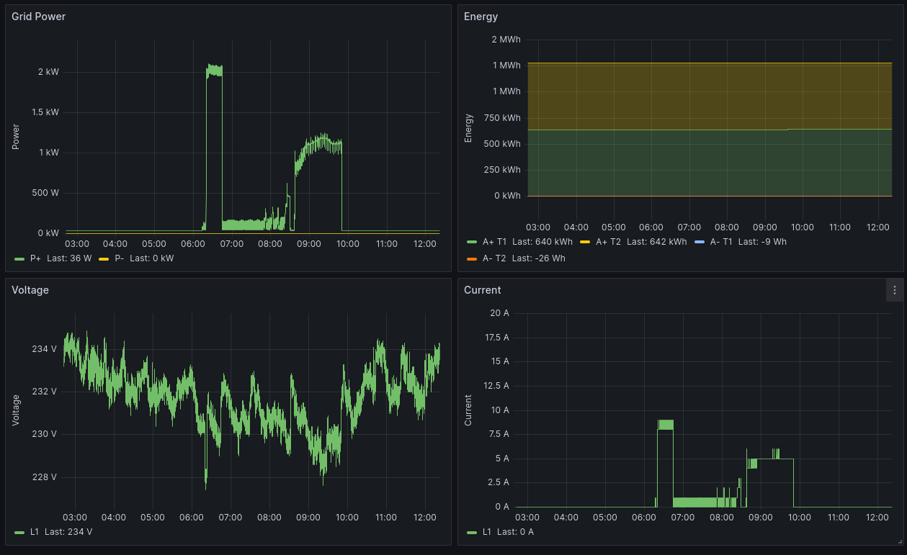

# P1 Port monitoring tool

Data logger and basic visualisation tool for Belgian Smart meters



:arrow_up: Reads data from:

- P1-Port implementing the DSMR protocol with 1-second resolution.
- \*Plain text file with DSMR telegrams (for test purposes only).

:arrow_down: Logs data into:

- Terminal (Default)
- Plain text file as JSON objects
- TimescaleDB instance
- MQTT Broker

## Roadmap

- Add instructions for deployment in Raspberry Pi devices
- Add utilities to back up data from DB
- Add example Jupyter Notebooks on data reading and visualisation

## Table of Contents

1. [Prerequisites](#prerequisites)
2. [Hardware installation](#hardware-installation)
3. [Configuration](#configuration)
4. [Standalone usage](#standalone-usage)
5. [Docker image usage](#docker-image-usage)
6. [Docker compose usage](#docker-compose-usage)

## Prerequisites

### Hardware

The operation of this software is designed and tested to work with:

- Smart Meter: Fluvius 1-phase and 3-phase electricity meters, as well as gas and water meters connected to them via wM-Bus.
- P1-port interface such as [Slimme meter kabel - P1 to USB](https://webshop.cedel.nl/Slimme-meter-kabel-P1-naar-USB).
- Computer or an embedded data logger such Raspberry Pi Models 3, 3B+, 4.

> Note that the P1 reader must be activated in advance. [Fluvius activation link](https://mijn.fluvius.be/poortbeheer)

### Software

The P1 Port monitoring tool is developed in `python`. Nevertheless, we also provide and maintain a
[Docker image](https://hub.docker.com/r/ejpalacios/p1-reader) to facility its deployment using a `docker-compose` file. The requirements for each case are provided below.

#### Standalone requirements

A working version of `python` is required to run the monitoring tool.
To check if `python` is already installed in your system simply requirements

```bash
$ python --version
Python 3.9.16
```

Otherwise, please refer to the [Official Documentation](https://www.python.org/downloads/) for your operating system. We recommend to use `python~3.9` or below.

To manage dependencies we make use of [Poetry](https://python-poetry.org/). Please follow the [Installation Instructions](https://python-poetry.org/docs/#installation). Then, check that is properly working by running:

```bash
$ poetry --version
Poetry (version 1.5.1)
```

Subsequently, one can install all the necessary dependencies by simply running

```bash
$ poetry install
```

And to activate the virtual environment just execute:

```bash
$ poetry shell
```

Alternatively, we also provide `requirement.txt` files to create a virtual environment using other tools such as `venv`. The following commands can be use to instantiate the new virtual environment and install all dependencies.

```bash
$ python3 -m venv .venv
$ .venv/bin/pip install --upgrade pip
$ .venv/bin/pip install -r requirements/prod.txt
$ .venv/bin/pip install -r requirements/opt.txt
$ .venv/bin/pip install -r requirements/test.txt
$ .venv/bin/pip install -r requirements/dev.txt
```

Please note that in both cases, `poetry` or `venv`, dependencies are divided into four groups

- Production (`main` or `prod.txt`): are necessary to execute the monitoring tool
- Optional (`opt` or `opt.txt`): are required to run the example `jupyter notebooks`
- Development (`dev` or `dev.txt`): are using during development
- Testing (`test` or `test.txt`): are needed to run the tests.

#### Containerised deployment requirements

For those interested in simply running the utility, a [docker image](https://hub.docker.com/r/ejpalacios/p1-reader) is provided.
A working `docker` or `podman` instance is required. Please follow the official documentation depending on your platform

- [Docker Documentation](https://docs.docker.com/)
- [Podman Documentation](https://podman.io/docs/)

Moreover, a set of convenient `docker-compose` files is provide for an automated deployment.
In order to make use of these files, please install either `docker-compose` or `podman-compose`

```bash
$ pip3 install docker-compose
# or podman
$ pip3 install podman-compose
```

## Hardware installation

To capture the data from your Smart Meter two simple connections should be made:

1. Connect the P1 cable to the smart meter using the RJ12 connector.
2. Connect the USB end of the P1 cable to the computer or embedded data logger.

## Configuration

The data sources and logging destinations are configured via environment variables or using a `yaml` file

### Input sources

There are two input data sources which can be configured.
Please note they **CANNOT be use simultaneously**.

#### Serial Port

Gets the input data stream from a serial port.
The following `yaml` block must be used to configure the identifier `id` of the port.

```yaml
# config.yaml
port:
  id: "/dev/ttyUSB0"
```

Alternatively, the following environment variable can be be given

```bash
# ENV VARIABLES
PORT__ID="/dev/ttyUSB0"
```

> Note that in window systems the identifier will look something like `COM[x]`

#### DSMR telegrams plain file

The telegram plain file data source is only used for testing purposes.
Yet, it can be configured by indicated the path to the input data file, using either of the methods below.

```yaml
# config.yaml
file:
  path: "data/test.txt"
```

```bash
# ENV VARIABLES
FILE__PATH="data/test.txt"
```

### Logging destinations

In contrast with the input sources, the logging destinations are cumulative.
This means that the utility can simultaneously store the data in a JSON objects file, a DB, and send them via MQTT if all data sinks are configured.

#### JSON objects file

To log the data into a plain text file containing a JSON object for each measurement, we need to indicate the destination file either in the `config.yaml` file or with an environment variable.

```yaml
# config.yaml
dump:
  file: "data/output.json"
```

```bash
# ENV VARIABLES
DUMP__FILE="data/output.json"
```

#### Database

To use a TimescaleDB as data sink, we have to configure the:

- `host`: IP of the database instance (required)
- `port`: Port on which the database is listening (optional, default: 5432)
- `database`: Name of the database (optional, default: premises)
- `user`: Username to log into the database (optional, default: postgres)
- `password`: Passphrase to log into the database (optional, default: password)

These values can again be passed with a `config.yaml` file or environment variables.

```yaml
# config.yaml
db:
  host: "localhost"
  port: 5432
  database: "premises"
  user: "postgres"
  password: "password"
```

```bash
# ENV VARIABLES
DB__HOST=timescaledb
DB__PORT=5432
DB__DATABASE=premises
DB__USER=postgres
DB__PASSWORD=password
```

> The logging utility takes care of creating the necessary tables. However, the database must be up and running when the utility is started.

#### MQTT broker

Finally, the last destination for the logged data is an MQTT broker. The configuration is provided with the blocks in the `config.yaml` file or environment variables.

- `host`: IP of the MQTT broker instance (required)
- `port`: Port on which the MQTT broker is listening (optional, default: 1883)
- `qos`: Quality of service for the messages (optional, default: 1)

```yaml
# config.yaml
mqtt:
  host: "localhost"
  port: 1883
  qos: 1
```

```bash
# ENV VARIABLES
MQTT__HOST=mosquitto
MQTT__PORT=1883
MQTT__QOS=1
```

All telegram are published as JSON objects on the topic:

```bash
telgram/$DEVICE_ID
```

Where `$DEVICE_ID` represents the identification number of the Smart Meter as written on the physical device.

## Standalone usage

To execute the utility once it has been configured via the `config.yaml` file simply use the following command.

```bash
$ poetry run python -m p1reader --config config.yaml
# or using venv
$ .venv/bin/python -m p1reader --config config.yaml
```

This is the easiest way to manage the standalone version. However, it is also possible to NOT use a `config.yaml` and provide all the configuration via environment variable such as:

```bash
# Export environment variables
$ export PORT__ID="/dev/ttyUSBO"

# Run utility with poetry
$ poetry run python -m p1reader
# or using venv
$ .venv/bin/python -m p1reader
```

## Docker image usage

Running the utility as a docker image is straightforward.
First, pull the latest version of the image from [dockerhub](https://hub.docker.com/r/ejpalacios/p1-reader).

```bash
$ docker pull docker.io/ejpalacios/p1-reader
```

Then, spin up the container using the docker run command.

```bash
$ docker run -d \
    -e PORT__ID='/dev/ttyUSB0' \
    --name p1-reader \
    docker.io/ejpalacios/p1-reader
```

Note, that the `docker` image must be configured using environment variables, which are passed on to the container with the argument `-e` followed by the name and value of that variable.

## Docker compose usage

To facility even more the deployment of the system two `docker-compose` files are provided.
The first one, located in the folder `docker/services` deploys:

- A local TimescaleDB instance
- A local MQTT broker instance
- A local Grafana instance (visualisation)

> All the default values in this `docker-compose` file will provide a working instance but it is not recommended for production environments.

The second `compose` file in `docker/p1reader` configures and run the P1 Port logging utility.
Note that the value of the environment variable defaults to `PORT__ID="/dev/ttyUSB0` and might need to be adjusted.

To bring up the deployment a three step procedure is needed.

First, we need to create a `docker` network to be shared by the deployments.

```bash
$ docker network create premises
```

By default, the name of this network is `premises`. Nevertheless, a different name can be chosen, providing the `docker-compose.yml` files are edited accordingly.

Secondly, we need to spin up all the services with the command

```bash
$ docker-compose -f docker/services/docker-compose.yml up -d
```

Here, the flag `-d` is used to detach the terminal output.

Finally, once all the services are up and running, the logger utility can also be initialised.

```bash
$ docker-compose -f docker/p1reader/docker-compose.yml up -d
```

To verify that all services are deployed the following docker command can be used:

```bash
$ docker ps
CONTAINER ID  IMAGE                                        COMMAND               CREATED         STATUS                   PORTS                                           NAMES
8e629fceab44  docker.io/ejpalacios/p1-reader              "python -m p1reader"   50 seconds ago  Up 51 hours                                                              p1-reader
10eaf408d0d9  docker.io/timescale/timescaledb:latest-pg14  postgres              42 seconds ago  Up 43 seconds (healthy)  0.0.0.0:5432->5432/tcp                          timescaledb
6cf23d8e9af1  docker.io/library/eclipse-mosquitto:latest   /usr/sbin/mosquit...  41 seconds ago  Up 41 seconds            0.0.0.0:1883->1883/tcp, 0.0.0.0:9001->9001/tcp  mosquitto
b1854fba72ca  docker.io/grafana/grafana:latest                                   39 seconds ago  Up 40 seconds            0.0.0.0:3000->3000/tcp                          grafana
```

### Measurements Visualisation

As part of the `docker-compose` deploy, a visualisation utility is included using Grafana.
To access this page go to [http://localhost:3000] and log in with the default credentials.

- user: `admin`
- password: `admin`.
  There are three dashboards available, which can be access by going to Dashboards → Browse → Premises → [Select Dashboard]

1. Measurement logger: Real-time electricity measurements
2. Gas & Water logger: When installed, it displays the real-time measurements from these type of meters as collected via the Wireless M-Bus interface.
3. Maximum demand logger: Historical monthly consumption peak and real-time tracking of maximum demand

## Licence notice

Please note that although this code
[](https://github.com/pwitab/dlms-cosem/blob/master/LICENSE)

## Acknowledgement

This work has been supported by the Research Foundation Flanders (FWO) within the MSCA - SoE project, "Premises: PRoviding Energy Metering Infrastructures with Secure Extended Services", grant number 12ZZV22N.
[More Information](https://www.esat.kuleuven.be/electa/premises)
